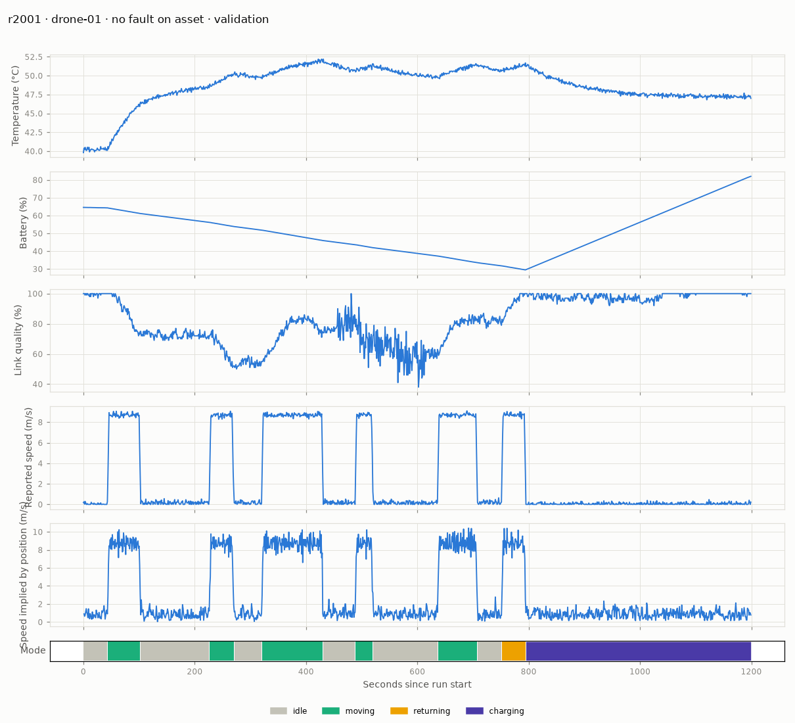
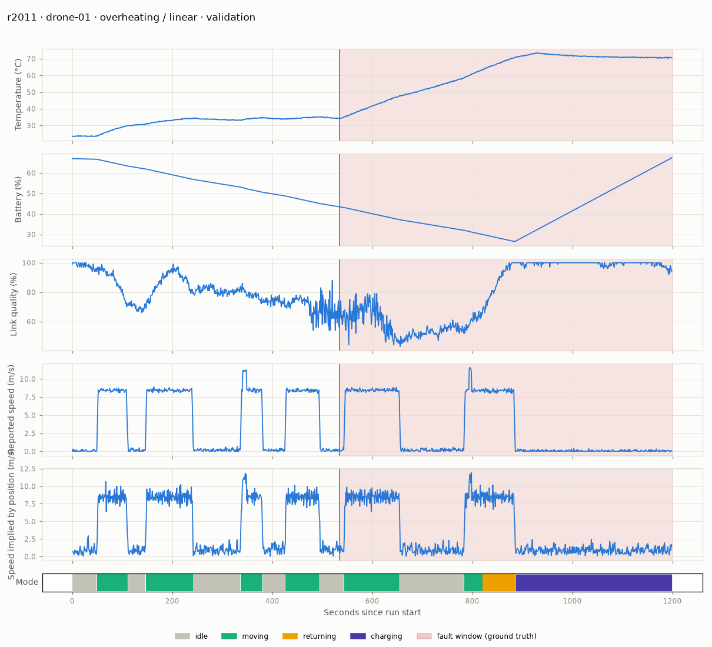

# Data card: Signal fleet telemetry v1.0.0-9e903f9008

## Summary

Synthetic, deterministic telemetry for a three-asset inspection fleet (one drone, one rover, one quadruped), with fault scenarios injected on top of causally simulated normal behaviour. 140 runs × 3 assets × 20 minutes at 1 Hz = **502,976 events** (1,024 events, 0.2 %, deliberately lost in transit). Ground truth is stored separately from the telemetry and is used only for evaluation.

```bash
signal-data generate     # one command, ~20 s, byte-identical on every run
signal-data summary      # split / scenario / variant / episode counts
```

The data version is a hash of `configs/data.yaml`, `configs/splits.yaml` **and** the generator source, so any change to the data-generating process produces a new version string. Every model artifact and result records the data version it used.

## Why synthetic, and why not Blackbox's simulator

No hardware is involved (brief). Blackbox's simulator was built to exercise ingestion, not to look physical: its temperature, battery and link quality are independent random walks, so it has no meaningful "normal envelope" and cannot express causal faults like "the battery drains faster than this activity explains". Signal therefore generates its own runs, but **on the Blackbox event contract**: the same field names, units and modes (`idle`, `moving`, `returning`, `charging`), so Blackbox telemetry can be replayed through Signal without a translation layer. The scorer also accepts Blackbox's nested `position` object.

## Schema

| Field | Unit | Notes |
|---|---|---|
| `run_id` | | `r<seed>`; carries no scenario information |
| `asset_id`, `asset_type` | | `drone-01`/drone, `rover-01`/rover, `quad-01`/quadruped |
| `seq` | event | per asset, from 0; still advances when an event is lost |
| `timestamp_utc` | | run start + seq seconds |
| `x_m`, `y_m`, `z_m` | m | GPS-style noisy position (Blackbox nests these under `position`) |
| `speed_mps` | m/s | reported speed, noisy, quantised 0.01 |
| `heading_deg` | deg | [0, 360) |
| `battery_pct` | % | 0–100, quantised 0.01 |
| `temperature_c` | °C | quantised 0.1 |
| `link_quality_pct` | % | 0–100, quantised to whole percent |
| `mode` | | `idle`, `moving`, `returning`, `charging` |

## How normal behaviour is generated

Each asset runs a mission: park → move to a random waypoint → inspect → next waypoint → … → return to base → charge. The physics is simple but causal, so signals relate to each other the way an operator would expect:

- **Load** comes from what the asset is doing (parked, inspecting or hovering, moving, charging, hard manoeuvre).
- **Battery** drains as `(idle + k · load)` %/min and charges at a per-type rate that tapers above 80 %.
- **Temperature** follows `ambient + gain · load (+ charging heat)` through a first-order lag (τ = 90–150 s). Ambient is drawn per run from 22–42 °C (UAE daytime).
- **Link quality** falls with distance from base (`100 · (1 − 0.7 · (d/range)^1.5)`), plus slow AR(1) fading and white noise.
- **Position** integrates heading and speed, with limited acceleration and turn rate; reported positions add GPS noise.

**Difficult normal behaviour** is part of every split and is logged to `ground_truth/episodes.parquet` for false-positive analysis (never used as a feature). Per normal run, on average:

| Episode | Train | Validation | Test |
|---|---|---|---|
| charging | 2.2 | 1.9 | 1.9 |
| returning to base | 2.1 | 2.0 | 1.9 |
| hard manoeuvre (speed ×1.3–1.8 plus a swerve) | 8.5 | 8.6 | 8.7 |
| noisy-link episode | 1.5 | 1.9 | 1.4 |

### Distributions (all splits)

| | Drone | Rover | Quadruped |
|---|---|---|---|
| Temperature p1 / median / p99 (°C) | 27.5 / 41.9 / 68.4 | 26.7 / 38.7 / 72.4 | 27.6 / 42.6 / 75.4 |
| Battery p1 / median / p99 (%) | 28.1 / 59.6 / 95.8 | 35.5 / 68.9 / 96.2 | 23.8 / 60.8 / 95.5 |
| Link p1 / median (%) | 47 / 85 | 52 / 86 | 51 / 87 |
| Speed median / p99 (m/s) | 0.2 / 12.7 | 1.1 / 2.4 | 0.9 / 1.9 |
| Time charging / idle / moving / returning (%) | 28 / 38 / 30 / 3 | 19 / 25 / 50 / 6 | 18 / 25 / 51 / 6 |

Per-split medians are close (temperature 40.8–41.4 °C, link 86–87 %, battery 61–66 %); there is no deliberate covariate shift between splits beyond the fault ranges described below. The p99 temperatures include overheating faults.



## Fault scenarios and labels

One fault per fault run, on one asset. Physical faults (overheating, battery drain, link degradation) start at a planned onset drawn from 25–60 % of the run. Sensor faults (freeze, motion anomaly) wait from that planned onset until the asset is moving, up to 300 s and never past 80 % of the run, so they can start as late as seq 960 (r3024 and r3043 in test). Faults are balanced across assets (each fault type hits each asset equally often) and across variants.

| Fault | Kind | Variants (validation) | Extra test-only variants | Window |
|---|---|---|---|---|
| overheating | physical, progressive | linear drift | runaway (accelerating) | to end of run |
| battery_drain | physical, progressive | step increase in drain | accelerating drain | to end of run |
| link_degradation | physical, progressive | decline to dropout; growing oscillation | intermittent short dropouts | decline / intermittent: to end; oscillation: 2–8 min then recovers |
| sensor_freeze | sensor, abrupt | temperature, battery, link or speed stuck | position stuck; two fields stuck | 40–300 s |
| motion_anomaly | sensor, abrupt | position jump (offset on, then off); reported speed × factor | position drift | 20–240 s |

**Parameter ranges.** Validation uses the `standard` ranges and test the wider `wide` ranges (configs/data.yaml). For example, overheating rate is 4–10 °C/min in validation and 2–14 °C/min in test; extra battery drain is 2–5 vs 1–6.5 %/min; jump size is 40–150 m vs 15–250 m. Values actually sampled: overheating 6.0–9.8 (validation) vs 2.2–13.9 °C/min (test); drain 2.4–2.9 vs 1.1–5.8 %/min.

**Label definition.** `fault_start_seq` is the event at which the fault process begins: the first event with extra heat or drain, the first frozen or offset report. It is not when the fault becomes visible. That is deliberate: detection latency is measured from the true start. Sensor faults wait for the asset to be moving before starting (a speed frozen on a parked asset would be a meaningless label), up to a deadline.

**Files** (`data/<version>/ground_truth/`):

- `runs.parquet`: run → seed, split, scenario.
- `faults.parquet`: asset, type, variant, start and end (seq and UTC), parameters.
- `episodes.parquet`: difficult-normal episodes.

The feature and model code can only read `telemetry.parquet`.

## Split boundaries

| Split | Seeds | Runs | Faults | Use |
|---|---|---|---|---|
| train | 1000–1039 | 40 normal | none | fit detectors and normalisation statistics |
| validation | 2000–2039 | 10 normal + 30 fault (6 per type) | standard ranges, seen variants | features, model choice, hyperparameters, incident params, thresholds |
| test | 3000–3059 | 15 normal + 45 fault (9 per type) | wide ranges, plus 6 unseen variants (16 of 45 faults) | the official result, run once |

The split is by **seed and run**, never by row. Runs are also disjoint in time: run *s* starts at `2026-09-01 + s hours`, so every test run comes after every validation run, which comes after every train run. `configs/splits.yaml` is the single source; `signal-data summary` prints the seed ranges.

## Leakage controls (each one is tested)

| Risk | Control | Test |
|---|---|---|
| Fault label as a feature | ground truth in separate files and modules; feature, detector and service code never import them | AST scan of `features/` and `detectors/`; telemetry loader import check |
| Neighbouring rows across sets | split by seed and run; seeds and times disjoint | `test_splits.py` |
| Windows crossing runs | features computed per (run, asset) | `test_windows_never_cross_runs_or_assets` |
| Features seeing the future | trailing windows only | `test_features_are_causal` (truncating the future changes nothing) |
| Fault leaking backwards in time or to other assets | separate RNG stream per concern | a fault run equals the same seed's normal run before onset and on other assets |
| Scenario inferable from run id or seed order | `run_id = r<seed>`; scenarios shuffled within a split | `test_run_order_does_not_reveal_scenario` |
| Statistics fit on non-train data | `assert_only_split` before every fit | `test_split_guard_rejects_foreign_runs` |
| Test set used for selection | selection code never loads test; official result written once; frozen artifacts committed and never overwritten | `test_official_result_cannot_be_overwritten`, `test_evaluated_model_cannot_be_overwritten` |

## Known limitations

- **Synthetic physics.** The normal envelope is my model of the fleet, not measured behaviour. Real sensors drift, saturate and fail in correlated ways this generator does not produce.
- **Designer bias.** I wrote the fault generator and the rule baseline. Wider test ranges and unseen variants were meant to counter this; the unseen variants turned out *easier*, not harder (see EVALUATION.md). The rule baseline's test result is therefore likely optimistic relative to real faults.
- **Small fault counts.** 30 validation and 45 test faults. One fault moves recall by 2–3 points, and confidence intervals are wide (see EVALUATION.md).
- **Narrow validation sample for battery drain.** The six validation drain faults happened to sample only 2.4–2.9 %/min, so threshold selection saw little variety for that fault.
- **A hard freeze during charging.** In test run r3025 a speed freeze reached its deadline and started while the drone was charging. It is still observable (charging speed normally flickers, so a stuck 0.00 grows `speed_unchanged` far beyond normal) and the robust-z baseline caught it, but rules written for moving assets cannot. *(An earlier version of this card called it an unobservable, invalid label; that was wrong.)*
- **Test data was looked at during development.** The generator's sanity-plot gallery originally included one test run per fault variant, and three test runs were viewed while checking the generator, before any detector limit or threshold was set. Nothing was chosen from them, but it is disclosed here and in EVALUATION.md; the gallery is now validation-only.
- **One fault per run, one fleet.** No simultaneous faults, no fleet-wide events (such as a base-station outage), and no asset ids beyond one per type.
- **No telemetry pathologies from Blackbox.** No duplicates, out-of-order events or clock skew; Blackbox already handles those upstream. Only rare single-event loss is simulated.


