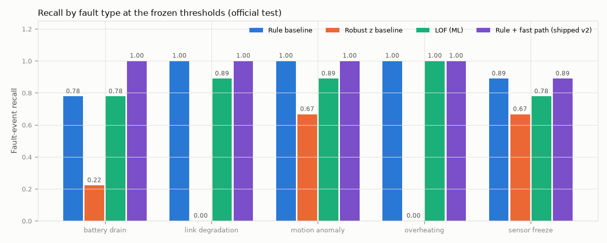

# Evaluation (v2)

> **Headline.** The shipped v2 system, the **rule baseline plus a fast-path residual detector** (`hybrid_rule_fast`), meets **7 of the 8** acceptance criteria on a **fresh, pre-registered test set** (seeds 4000–4059, run once): precision 0.85, recall 0.98 (44 of 45), 0.12 false incidents per 10 min. It ships under a ship rule declared before that test existed, on a **significant latency gain** with no recall loss. **Latency (criterion 5) is not met by the project's original definition**: over all progressive faults the median is 11 events. It is met (1 event, 5 of 5 caught) only on a narrower, physics-based "expected to catch" set declared for v2. The original plan (PLAN §7.1) said that narrowing the set later would count as a failure, so I count it as one. Slow overheating and link decline cannot be seen in 3 seconds at this sensor noise.
>
> v1 (tag `v1.0.0`) missed two criteria on its own test set; that result stands unchanged in [v1/EVALUATION_v1.md](v1/EVALUATION_v1.md). v2 was designed from v1's test-set error analysis, so v1's test set is spent and v2 is judged only on new data (PLAN_V2 §1).

All numbers come from saved outputs: `results/validation/` (v2 selection) and `results/official/` (the v2 test, run once). Figures are regenerated with `signal-eval plots`.

## Acceptance criteria (the brief's definition of done)

| # | Criterion | v1 (test seeds 3000–3059) | **v2 (test seeds 4000–4059)** | Evidence |
|---|---|---|---|---|
| 1 | Normal + ≥ 5 fault scenarios, repeatable runs, stored ground truth | ✅ | ✅ | 5 fault types in 16 variants; deterministic per seed; ground truth stored apart and loadable only by evaluation code (DATA_CARD) |
| 2 | Leakage-safe, documented split | ✅ | ✅ | split by seed and time; `signal-eval audit`; v2 models frozen and **pushed (d121e2a) before the v2 test runs were generated** |
| 3 | Baselines and ML on the same held-out test | ✅ | ✅ | rule, robust z, LOF and the shipped system on the same 60 runs, one run-once evaluation |
| 4 | Test precision ≥ 0.75, recall ≥ 0.85, ≤ 2 false incidents / 10 min | ❌ shipped rule recall 0.844 | ✅ **0.85 / 0.98 / 0.12** | §2 |
| 5 | Median progressive latency ≤ 3 events for faults the detector is expected to catch | ❌ every detector | ❌ **11 events** over all progressive faults, the set the original plan declared · ✅ 1 event on the narrower physics-based set declared for v2 (5 of 5 caught; a miss would count as infinite) | §1, §3, §7 pattern 1 |
| 6 | Defensible advantage over a baseline at a comparable operating point, or the baseline ships | ✅ (baseline shipped) | ✅ shipped system: recall not worse, latency significantly better, at nearly the same false-alert rate (0.12 vs 0.11) | §4 |
| 7 | Reproducible; saved result has exact model version and frozen threshold | ✅ | ✅ | `results/official/test_*.json`: `model_version`, `artifact_sha256`, `frozen_threshold`, `incident_params`, `data_version`; every test incident reproduced by replaying through the service (180 of 180 asset-runs) |
| 8 | Tests pass, errors analysed, honest inference failure states | ✅ | ✅ | 187 tests; §7; MODEL_CARD statuses |

**How criterion 5 is read, and why I count it as missed.** The brief limits the latency bar to "faults the detector is expected to catch". My original plan (PLAN §7.1, written before any code) declared that set as **all five fault types**, with the bar applying to the three progressive ones, and added: *"If a fault type is later dropped from this set, that is recorded as a failure, not a redefinition."* By that definition v2's latency is **11 events: a miss.**

For v2 I also declared a narrower set from physics, before the v2 test existed and without reference to any detector (PLAN_V2 §4, `eval/detectability.py`): a progressive fault counts if, 3 events after its labelled start, the change it has caused is at least 5× the noise of a 3-event difference of that signal. With the configured noise only abrupt battery drains qualify; overheating would need > 21 °C/min and link changes are buried in fading. On that set the shipped system's median is 1 event (5 of 5 caught; a miss would count as infinite latency, so missing hard cases cannot help). That number shows the fast path does what it was built for. But the set was defined after v1 had failed the bar, and narrowing it is exactly what the original plan ruled out, so it does not turn criterion 5 green. §7 pattern 1 explains why no detector at 1 Hz can meet the bar for slow drifts.

## 1. Protocol

Unchanged from v1 (v1 EVALUATION §1): a fault counts as detected when an incident opens on the faulted asset in `[fault_start, fault_end + 10)`; recall is per fault; precision is per incident, with per-fault precision alongside; false alerts are incidents overlapping no fault, per 10 minutes of normal fleet time; thresholds are chosen on validation under ≤ 1.5 false incidents / 10 min and precision ≥ 0.80; 95 % CIs resample whole runs.

New in v2 (all declared in PLAN_V2 before the test):

| | |
|---|---|
| Test set | **new**: seeds 4000–4059, same composition (15 normal, 45 faults), same wide ranges and the same 6 test-only variants as v1's test; generated after the freeze was pushed |
| Train / validation | the same runs as v1 (byte-identical) |
| Incident opening | chosen per candidate on validation: after 1 or 2 consecutive alerts (close after 5 quiet events and 30-event cooldown as before) |
| Expected-to-catch latency | median over the physics-defined set, misses = infinite (above) |
| Ship rule | the selected system ships over the best baseline (by **validation** recall) if recall is not worse (paired CI lower end > −0.05) **and** precision or progressive latency is significantly better; otherwise the baseline ships |

### Interpretations decided without sign-off

The two questions in PLAN §13 were never answered by the mentor. As in v1, I decided them and show the other reading:

| Question | Decision | Under the other reading (v2 test) |
|---|---|---|
| (a) Unit of "recall on fault-window detection" | per fault, counted once | per-event (window) recall: shipped 0.50, rule 0.49, LOF 0.51; every detector fails; the comparison is unchanged |
| (b) Wider ranges and unseen variants in test | kept (the same policy as v1) | seen variants only (29 faults): shipped 0.97, rule 0.90, LOF 0.79; the shipped system still passes recall |
| (c) "Expected to catch" | the **original plan's** definition (all fault types) decides the criterion; the v2 physics set is reported alongside | physics set: 1 event, meets the bar |

## 2. Official v2 test result

Frozen thresholds: rule −0.087, robust z 151.9, LOF 2.279, **rule + fast 1.175 (incident opens after 1 alert)**. Model versions `rule-ac784bbf45`, `stats-b688d29f11`, `lof-f9f000d78f`, `hybrid_rule_fast-a0918187ba`. Data version `v1.0.0-ee836a6bb4`. Normal fleet time 972.9 min.

| Detector | Precision | Recall | False incidents / 10 min | Expected-to-catch latency (caught) | All-progressive latency (p90) |
|---|---|---|---|---|---|
| **Rule + fast (shipped)** | 0.85 [0.76, 0.93] | **0.98** [0.93, 1.00] | 0.12 [0.06, 0.20] | **1** (5 of 5) | 11 (200) |
| Rule | 0.83 [0.74, 0.91] | 0.93 [0.85, 1.00] | 0.11 [0.05, 0.19] | 188 (4 of 5) | 76 (284) |
| LOF (ML) | **0.92** [0.84, 0.98] | 0.87 [0.76, 0.96] | **0.06** [0.02, 0.12] | 7 (4 of 5) | 25 (353) |
| Robust z | 0.63 [0.41, 0.84] | 0.31 [0.18, 0.45] | 0.09 [0.03, 0.16] | missed 4 of 5 | 403 (414) |

### Against the brief's bar

| | Precision ≥ 0.75 | Recall ≥ 0.85 | False ≤ 2 / 10 min | Expected-to-catch latency ≤ 3 | All-progressive latency ≤ 3 |
|---|---|---|---|---|---|
| **Rule + fast (shipped)** | ✅ 0.85 | ✅ 0.98 | ✅ 0.12 | ✅ 1 (narrow v2 set) | ❌ 11 (original definition) |
| Rule | ✅ 0.83 | ✅ 0.93 | ✅ 0.11 | ❌ 188 | ❌ 76 |
| LOF | ✅ 0.92 | ✅ 0.87 | ✅ 0.06 | ❌ 7 | ❌ 25 |
| Robust z | ❌ 0.63 | ❌ 0.31 | ✅ 0.09 | ❌ | ❌ 403 |

**The rule baseline alone also passes criterion 4 on this test set** (recall 0.93, against 0.844 on v1's). The two test sets come from the same generator and differ only in seeds; with 45 faults, one fault moves recall by 2.2 points, so a 4-fault swing between test sets is ordinary sampling variation. It means criterion 4 is not v2's main gain. Latency is (§4).

### Fragmentation and per-fault precision

| | Incident precision | Per-fault precision | Incidents per detected fault | Max on one fault | Faults with > 1 incident |
|---|---|---|---|---|---|
| Rule + fast | 0.85 | **0.79** | 1.52 | 5 | 13 of 44 |
| Rule | 0.83 | 0.79 | 1.26 | 4 | 8 of 42 |
| LOF | 0.92 | 0.87 | 1.77 | 6 | 16 of 39 |
| Robust z | 0.63 | 0.61 | 1.07 | 2 | 1 of 14 |

Per-fault precision (cannot be raised by splitting a fault into several incidents) stays above the 0.75 bar for the shipped system. Opening on 1 alert fragments more (pattern 4).

### Event-level confusion

| | Faults detected | Missed | True incidents | False incidents | Normal runs with a false incident | False incidents on fault runs |
|---|---|---|---|---|---|---|
| Rule + fast | 44 | 1 | 67 | 12 | 3 / 15 | 9 |
| Rule | 42 | 3 | 53 | 11 | 1 / 15 | 10 |
| LOF | 39 | 6 | 69 | 6 | 1 / 15 | 4 |
| Robust z | 14 | 31 | 15 | 9 | 3 / 15 | 5 |

## 3. Per fault (test)

| Fault type | Rule + fast recall (latency) | Rule | LOF | Robust z recall |
|---|---|---|---|---|
| battery drain | **1.00 (2)** | 0.78 (188) | 0.78 (11) | 0.22 |
| overheating | 1.00 (**11**) | 1.00 (64) | 1.00 (18) | 0.00 |
| link degradation | 1.00 (76) | 1.00 (73) | 0.89 (81) | 0.00 |
| motion anomaly | 1.00 (1) | 1.00 (2) | 0.89 (2.5) | 0.67 |
| sensor freeze | 0.89 (11.5) | 0.89 (12) | 0.78 (17) | 0.67 |

**The five expected-to-catch faults** (battery drains ≥ 1.5 %/min):

| Run | Asset | Variant | Rule + fast | Rule | LOF |
|---|---|---|---|---|---|
| r4000 | quadruped | step, 2.4 %/min | 187 (pattern 2) | 188 | 7 |
| r4009 | drone | step | **1** | missed | missed |
| r4029 | rover | step | **1** | 26 | 4 |
| r4030 | drone | accelerating | **0** | 323 | 4 |
| r4045 | rover | accelerating | **1** | 89 | 122 |

**Seen vs unseen variants.** Rule + fast: 16 of 16 unseen, 28 of 29 seen. Rule 16/16 and 26/29; LOF 16/16 and 23/29. As in v1, the unseen variants were the easier ones.

## 4. Shipped system vs baseline at a comparable operating point

The two operate at almost the same false-alert rate on test (0.12 vs 0.11 per 10 min), both under the same validation constraints.

**Paired test differences, rule + fast minus rule** (same runs resampled; 95 % CI):

| | Difference | CI | |
|---|---|---|---|
| Recall | +0.044 | +0.000 to +0.119 | not worse (the ship rule needs CI low > −0.05) |
| Precision | +0.020 | −0.082 to +0.111 | no significant difference |
| False incidents / 10 min | +0.010 | −0.063 to +0.092 | no significant difference |
| Median progressive latency, 25 faults both caught | −1 event | −37 to −1 | **significantly faster** |

**Ship decision (pre-declared rule v2): `hybrid_rule_fast` ships** ("recall not worse and significantly better on latency"). The registry serves it.

How big the latency gain is depends on where you look, and the honest summary has three parts:

- **The paired median gain is only 1 event.** Opening an incident on 1 alert instead of 2 removes one event from every detection; for most faults that is the whole difference.
- **The large gains are concentrated where the fast path was designed to help:** battery drain (median 188 → 2 events) and overheating (64 → 11).
- **At matched false-alert rates on the post-hoc test curves**, the rule and rule + fast reach similar recall (0.91 vs 0.89 on the sweep grid) while rule + fast is far faster (11 vs 90 events). Its defensible advantage is **speed, not recall**. The recall difference at the frozen points (+0.044) is partly the operating point.

**LOF**, the ML detector, has the best precision and fewest false alarms of all four (0.92, 0.06 / 10 min), but lower recall (0.87) and is slower than the shipped system on every fault type. It was not the selected candidate: on validation, every LOF system either missed the recall bar or, combined with the fast path, slowed it to 4–5 events (PLAN_V2 §5).

## 5. v1 → v2

| | v1 shipped (rule), v1 test | v2 shipped (rule + fast), v2 test |
|---|---|---|
| Precision | 0.81 | 0.85 |
| Recall | 0.844 ❌ | 0.978 ✅ |
| False incidents / 10 min | 0.12 | 0.12 |
| Battery-drain recall (latency) | 0.67 (103) | 1.00 (2) |
| Expected-to-catch latency | — | 1 ✅ |
| All-progressive latency | 71 ❌ | 11 ❌ |

The two columns are different test sets drawn from the same generator. The fair comparison is within the v2 test (§2–§4), where the v1 rule is one of the four detectors.

## 6. Threshold and grouping choice

All on validation (`results/validation/v2_candidates.csv`). For the shipped system, opening after 1 alert and opening after 2 gave the same validation recall (0.93); opening after 1 had the lower expected-to-catch latency (1.5 vs 2.5 events) at slightly lower precision (0.94 vs 0.98), so the pre-declared ranking chose 1. Its threshold 1.175 is the highest-recall point on the validation curve inside the constraints.

## 7. Error analysis (v2 test)

### Pattern 1: slow drifts still cannot meet a 3-event bar

All-progressive median latency is 11 events (rule + fast) against 3. Link decline (median 76) and slow overheating are physically invisible in 3 seconds at this noise (v1 pattern 5). The fast path cut overheating from 64 to 11 events through the 10-event temperature residual, but 3 events would need a drift above ~21 °C/min. *Next:* a CUSUM on the same residuals; a "detectable from" label in the generator.

### Pattern 2: a fault that starts exactly at a mode change hides from the fast path (r4000)

r4000's quadruped battery drain (2.4 %/min, expected to catch) started at seq 612, **the same second** the quadruped switched from idle to moving. The fast path is silent for 45 events after a mode change (its 30-event baseline would span two modes), and by the time it re-arms its baseline already contains the extra drain, so the residual is ~0. The rule caught it 187 events later. LOF caught it in 7. See `docs/figures/test_r4000_quad-01_battery_drain_step.png`. *Next:* re-arm the fast path against a per-mode expected drain (learned on train) instead of the asset's own recent slope, so a mode change does not hide an onset.

### Pattern 3: a link reading frozen at its ceiling while charging (r4023, missed by every detector)

r4023's quadruped link-quality reading froze for 46 events (seq 960–1005) while it was **charging at base** (about 20 m away), with the reading at 100 %, the top of the scale. Checked against normal data rather than assumed: in train, a charging quadruped's link reads an unbroken 100 for up to **271** events (other types: up to 154), because the reading saturates near base. This freeze produced 74 identical readings in a row (it began during an already-saturated stretch), inside that normal range. The rule's frozen-link check only runs while moving and below 99 %, and LOF and robust z see a value they have seen many times. With these signals the fault is indistinguishable from normal. *Next:* a freeze check on a signal that never saturates at base (for example, the raw RSSI behind the percentage), which this telemetry contract does not carry.

### Pattern 4: single-event false incidents from opening on 1 alert

6 of the shipped system's 12 false incidents are a single alert, which opening on 2 alerts would have absorbed (the validation trade-off in §6). The others come from the rule part's battery check near full charge (r4048, charge taper), a link-instability check on a drone (r4035), and fast-path battery residuals when an asset speeds up (r4037). *Next:* open after 1 alert only for the fast-path part and after 2 for the rule part.

### Pattern 5: alerts on change, not on state, so an incident can close while its fault continues

Found while rehearsing the demo, then counted from the saved results. On r4009 the shipped system opens an incident 1 event after the drone's battery drain starts (seq 698), then closes it at seq 730 while the drain continues to the end of the run. The fast path compares the asset against its own last 30 events, so once that window holds the new drain rate the residual returns to ~0. The rule part never fires on this drain. Across the v2 test, the last alert came more than 30 events before the fault ended for **14 of 44** faults the shipped system caught (rule 13 of 42, LOF 8 of 39). Nine of the 14 are overheating: the simulated heating levels off at its +40 °C cap (for the linear variant the last alert lands within 0–80 events of the cap), after which every slope-based check sees a hot but steady asset. Detection and latency are unaffected (they count the first open), but an operator would see "closed" for a live fault. *Next:* level checks against an expected value (temperature for this load, charge level for this elapsed time), and keep an incident open until the asset's state, not just its trend, is back to normal.

### False positive and false negative for the demo

- **False positive:** r4037 quadruped, seq 860: it speeds up from about 0.9 to 1.1 m/s, battery drain rises with it, and the 10-event residual reaches −0.68 %/min. The speed covariate explains only part of that, so the fast path alerts for two events. `signal-replay --run r4037 --asset quad-01 --show-truth`.
- **False negative:** r4023 quadruped link freeze, missed by every detector (pattern 3). The late catch r4000 (pattern 2) is the better example of the fast path's own limit.

## 8. Limitations of this evaluation

- **Small sets.** 45 test faults; only **5** expected-to-catch faults, so the expected-to-catch median rests on five numbers.
- **Designer bias is strongest in v2.** I wrote the generator's battery model and then built a detector for abrupt battery-slope changes. The fast path's success on battery drains is the least surprising result here; it says the feature matches the simulator, not that it would match a real battery.
- **Incidents measure onsets, not durations.** The protocol credits the first open; it does not check that an incident stays open while the fault lasts (pattern 5).
- **The ship rule changed between v1 and v2**, after I had seen v1's result. v2's rule was declared before the v2 test, but its shape (adding precision and latency as ways to win) was influenced by v1's outcome. Under v1's rule (recall CI excluding zero, or faster with no recall loss) the v2 system would also ship, on latency.
- **One selection rule was changed on validation** (PROCESS_LOG 2026-10-08): the shipped candidate no longer had to contain LOF. Legitimate before the test existed, but it was a choice made after seeing validation results.
- **The rule baseline also meets criterion 4 on this test**, so v2's advantage over it is latency (§4), not the recall bar itself.
- **Train and validation are v1's**, so validation has now selected v1 and v2. It was never test data, but it is no longer fresh either.
- Latency medians over *detected* faults (the all-progressive column) still have survivor bias; the expected-to-catch median does not.
