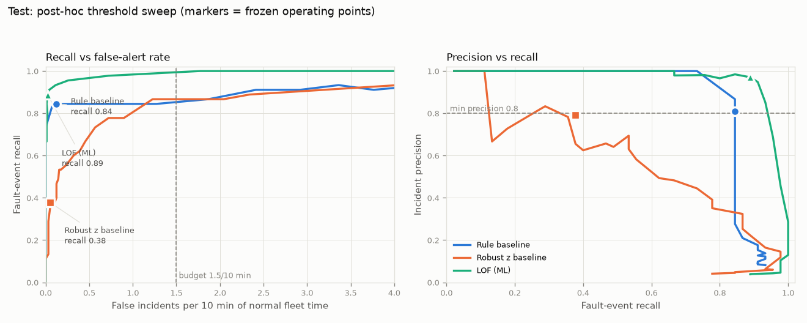

# Evaluation (v1, archived)

> **Archived v1 document.** This is the evaluation of v1 (tag `v1.0.0`, test seeds 3000–3059, run once on 2026-10-06), kept unchanged except for file paths. The current system and its evaluation are in [../EVALUATION.md](../EVALUATION.md).

> **Headline: the shipped system does not meet the brief's bar.** The rule baseline (shipped by the pre-declared decision rule) misses the recall bar by one fault (0.844 vs 0.85) and the latency bar by a wide margin (71 events vs 3). LOF meets precision, recall and false alerts but also misses latency (16 vs 3). No detector meets the 3-event latency bar for slow progressive faults (§8 pattern 5).

All numbers below come from saved outputs: `results/v1/validation/` (selection) and `results/v1/official/` (the test, run once). Figures are re-rendered from those files with `signal-eval plots`. Corrections made after an independent pre-release review are listed in PROCESS_LOG.md ("Pre-release review").

## Acceptance criteria (the brief's definition of done)

| # | Criterion | Status | Evidence |
|---|---|---|---|
| 1 | Normal behaviour + at least five fault scenarios, repeatable runs, stored ground truth | ✅ | 5 fault types (overheating, battery drain, link degradation, sensor freeze, motion anomaly) in 16 variants plus normal runs; generation is deterministic per seed (byte-identical on regeneration); ground truth is stored apart from telemetry and only evaluation code can load it (DATA_CARD) |
| 2 | Leakage-safe, documented train / validation / test separation | ✅ | split by seed and time (train 1000–1039, validation 2000–2039, test 3000–3059), zero overlap, `signal-eval audit`, leakage tests; the pre-freeze viewing of three test plots is disclosed (§1) |
| 3 | Both baselines and the ML detector evaluated on the same held-out test data | ✅ | rule, robust z and LOF on the same 60 test runs in one run-once evaluation (§2) |
| 4 | Official test ≥ 0.75 precision, ≥ 0.85 recall, ≤ 2 false incidents / 10 min | ❌ shipped rule; ✅ LOF | rule 0.81 / **0.844** / 0.12 (one fault short on recall); LOF 0.97 / 0.89 / 0.02 (§2) |
| 5 | Median progressive latency ≤ 3 events | ❌ every detector | rule 71, LOF 16, robust z 534.5; why a 3-event bar is out of physical reach for slow drifts at these labels: §8 pattern 5 |
| 6 | Defensible advantage over a baseline at a comparable operating point, or the conclusion says the baseline ships | ✅ (the "baseline ships" branch) | under the pre-declared rule LOF's recall and latency gains are not established, so **the rule baseline ships** and the conclusion says so (§5); LOF's significant precision and false-alert advantage at matched operating points is reported, not hidden (§4) |
| 7 | Reproducible retraining / evaluation from documented commands; saved result holds exact model version and frozen threshold | ✅ | README "Reproduce everything"; each `results/v1/official/test_*.json` holds `model_version`, `artifact_sha256`, `frozen_threshold`, `incident_params`, `data_version`, `feature_schema_hash`; the official test was re-run from scratch in clean clones twice and reproduced every number |
| 8 | Tests pass, errors analysed, inference handles insufficient data and model failure honestly | ✅ | 173 tests in CI; six error patterns plus one false positive and one false negative explained (§8); `insufficient_data` / `degraded` / `unavailable` and 422 / 413 instead of a silent `normal` (MODEL_CARD) |

**Six of eight are met; two are not, and they cannot be fixed honestly now.** The test set was used once, as the brief requires. Lowering a threshold, regrouping incidents or switching the shipped model to LOF after seeing the test would make criteria 4 or 6 look met by choosing from test results, which is the failure the whole protocol exists to prevent. The misses are reported as misses.

## 1. Protocol

| | |
|---|---|
| Unit of detection | **fault event**: one injected fault on one asset in one run |
| Detected | an incident **opens or re-opens** on the faulted asset in `[fault_start, fault_end + 10)` |
| Recall | detected fault events / fault events |
| Precision | incidents overlapping a fault window on the right asset / all incidents (**incident precision**; per-fault precision, which cannot be raised by splitting a fault into several incidents, is reported alongside: §2) |
| False-alert rate | incidents overlapping no fault, per **10 minutes of normal fleet time** (scorable asset-seconds outside fault windows ÷ 3 assets) |
| Latency | events from `fault_start` to the first in-window open; the bar applies to progressive faults (overheating, battery drain, link degradation) |
| Incident grouping | open after N = 2 consecutive alerts, close after M = 5 quiet events, re-open within C = 30 events counts as the same incident; chosen on validation from the baselines, shared by every detector |
| Threshold | per detector, on **validation**: false alerts ≤ 1.5 per 10 min **and** precision ≥ 0.80, then highest recall, then lowest latency |
| Test | frozen artifacts, evaluated once (`signal-eval test`); a second run is refused |
| Uncertainty | 95 % bootstrap CIs resampling **whole runs** (2,000 resamples); paired for comparisons |

An alarm that was already open before a fault started counts as a true positive (it overlaps the fault) but **not** as detecting it, so a noisy detector cannot take credit for faults it never reacted to.

### Interpretations decided without sign-off

Two questions about the brief went to the mentor before the build (PLAN §13) and were not answered before the deadline. I decided them myself, chose the reading the brief's own wording supports, and checked that **no conclusion depends on the choice**. If the intended reading differs, the alternative numbers below come from the same saved files (labelled post-hoc); the official result is not re-run.

| Question | Decision | Why | Under the other reading |
|---|---|---|---|
| (a) What unit is "recall on fault-window detection"? | **Per fault**: each injected fault counts once; detected if an incident opens in `[fault_start, fault_end + 10)` | The same criterion counts "false incident alerts", and latency is measured to an incident opening, so the bar is about incidents. Counting every flagged second would reward alarming continuously, which the incident grouping exists to stop. | Per-event (window) recall: rule 0.37, LOF 0.42, robust z 0.05 (§2). Every detector fails; the rule still ships; nothing changes. |
| (b) May test contain wider parameter ranges and fault variants never seen in validation? | **Yes**, kept as generated: wider ranges, 16 of 45 faults are unseen variants | The brief warns against a test set that only contains anomalies like the training ones, and I wrote both the generator and the rules (designer bias). Regenerating test after seeing the result would make it a second, chosen test. | Seen variants only (29 faults): rule recall 0.76, LOF 0.83. The unseen variants were *easier* (both caught 16 of 16), so this reading is stricter: **LOF's pass of the recall bar depends on them.** The rule still ships (LOF − rule on that subset is +0.07, paired run-level bootstrap 95 % CI −0.10 to +0.24, post-hoc) and the shipped system still misses the bar. |
| (c) Which faults is a detector "expected to catch" for latency? | The progressive faults it **did** catch (median over detected faults) | No pre-declared notion of "detectable" exists in the labels; using detected faults is the most lenient honest reading. | Any stricter reading can only add faults with longer latency; the bar is missed either way (§8 pattern 5). |

**Split.** Test is 60 runs (15 normal, 45 fault), seeds 3000–3059. It contains 969.5 minutes of normal fleet time. 16 of its 45 faults are variants never seen in validation.

**Disclosure: test data was looked at before the freeze.** While building the generator (PROCESS_LOG, Section 2), the data-sanity plot gallery drew one example of every fault variant from validation **and test**, and I viewed three test runs (r3000, r3032, r3037) to check the generator. That was before the rule limits were set (01:12) and before the official run (01:34 on 6 Oct). The rule limits were taken from train-normal envelopes only (`results/v1/validation/rule_envelopes_train.csv`), and no threshold, feature, model or parameter was chosen from those plots, but "test never seen before the freeze" is not literally true and is not claimed. The gallery is now validation-only.

## 2. Official test result

Frozen thresholds: rule −0.087, robust z 151.9, LOF 2.279. Model versions: `rule-64d39edc1d`, `stats-ab89662ec6`, `lof-a588a4d11b`. Data version `v1.0.0-9e903f9008`.

| Detector | Precision | Recall | F1 | False incidents / 10 min | Median latency, progressive (p90) | Median latency, all faults |
|---|---|---|---|---|---|---|
| **Rule** (shipped) | 0.81 [0.70, 0.91] | 0.84 [0.73, 0.94] | 0.83 | 0.12 [0.05, 0.21] | 71 (183) | 20 |
| Robust z | 0.79 [0.65, 0.93] | 0.38 [0.24, 0.52] | 0.51 | 0.05 [0.01, 0.10] | 534.5 (584) | 52 |
| LOF (ML) | **0.97** [0.92, 1.00] | **0.89** [0.79, 0.98] | **0.93** | **0.02** [0.00, 0.05] | **16** (429) | **9** |

### Against the brief's bar

| | Precision ≥ 0.75 | Recall ≥ 0.85 | False alerts ≤ 2 / 10 min | Median progressive latency ≤ 3 |
|---|---|---|---|---|
| Rule | ✅ 0.81 | ❌ 0.844 | ✅ 0.12 | ❌ 71 |
| Robust z | ✅ 0.79 | ❌ 0.38 | ✅ 0.05 | ❌ 534.5 |
| LOF | ✅ 0.97 | ✅ 0.89 | ✅ 0.02 | ❌ 16 |

No detector meets the latency bar. The shipped rule baseline misses the recall bar by 0.006 (38 of 45 detected; 39 would pass). The latency gap is discussed in §8. The ship rule (§5) required the ML model to be *significantly better*; it never required the shipped system to meet the bar, which in hindsight it should have.

### Incident fragmentation and per-fault precision (post-hoc, from the saved files)

Must-have 9 asks that one fault becomes one incident. It does not always: an incident closes after 5 quiet events, and if a fault's alerts pause for longer than the 30-event cooldown, the next alert opens a new incident. Each of those incidents counts as a true positive in incident precision, which flatters detectors that fragment. `signal-eval fragmentation` (writes `results/v1/official/posthoc/fragmentation.json`):

| Test | Incident precision | **Per-fault precision** | Incidents per detected fault | Max on one fault | Faults with > 1 incident |
|---|---|---|---|---|---|
| Rule | 0.81 | **0.76** | 1.34 | 3 | 10 of 38 |
| Robust z | 0.79 | **0.77** | 1.12 | 2 | 2 of 17 |
| LOF | 0.97 | **0.95** | 1.62 | 6 | 17 of 40 |

Per-fault precision = detected faults / (detected faults + false incidents). On that measure the rule is **just above** the 0.75 bar (0.76) and LOF stays well above it. The fragmentation was already visible on validation (rule 1.36, LOF 1.44 incidents per detected fault) and should have been reported before the test; it is error pattern 6.

### Event-level confusion (test)

| | Faults detected | Faults missed | True incidents | False incidents | Normal runs with any false incident | False incidents on fault runs |
|---|---|---|---|---|---|---|
| Rule | 38 | 7 | 51 | 12 | 2 / 15 | 8 |
| Robust z | 17 | 28 | 19 | 5 | 2 / 15 | 3 |
| LOF | 40 | 5 | 65 | 2 | 0 / 15 | 2 |

Window-level confusion (secondary diagnostic: every scorable event, alert vs inside a fault window):

| | TP | FP | FN | TN | Window precision | Window recall |
|---|---|---|---|---|---|---|
| Rule | 7,251 | 383 | 12,183 | 174,328 | 0.95 | 0.37 |
| Robust z | 981 | 252 | 18,453 | 174,459 | 0.80 | 0.05 |
| LOF | 8,100 | 235 | 11,334 | 174,476 | 0.97 | 0.42 |

Window recall is low by design. A fault window lasts until the end of the run, but the operator needs one incident, not an alarm on every second. Event-level metrics are the decision metrics.

## 3. Per-fault results (test)

| Fault type | Rule recall | Rule latency | LOF recall | LOF latency | Robust z recall |
|---|---|---|---|---|---|
| overheating | 0.89 | 35.5 | **1.00** | **10** | 0.00 |
| battery drain | 0.67 | 103 | **0.89** | **7** | 0.33 |
| link degradation | 0.78 | 71 | **0.89** | 206 | 0.11 |
| motion anomaly | **1.00** | 2 | 0.89 | 3 | 0.67 |
| sensor freeze | **0.89** | 12 | 0.78 | 7 | 0.78 |

By variant (n per variant is 1–5, so read these as examples, not rates):

| Variant | n | Rule | LOF |
|---|---|---|---|
| overheating / linear | 5 | 4 | 5 |
| overheating / runaway (unseen) | 4 | 4 | 4 |
| battery drain / step | 5 | 2 | 4 |
| battery drain / accelerating (unseen) | 4 | 4 | 4 |
| link / decline | 3 | 1 | 3 |
| link / oscillation | 3 | 3 | 2 |
| link / intermittent (unseen) | 3 | 3 | 3 |
| motion / jump | 3 | 3 | 3 |
| motion / speed mismatch | 3 | 3 | 2 |
| motion / drift (unseen) | 3 | 3 | 3 |
| freeze / temperature, battery, link, speed | 7 | 6 | 5 |
| freeze / position, multi-field (unseen) | 2 | 2 | 2 |

**Seen vs unseen variants.** Recall on seen variants: rule 0.76, LOF 0.83. On unseen variants: rule 1.00, LOF 1.00. The variants held out of validation turned out more extreme, not subtler. The test was hard because of the wider parameter ranges, which produced weaker versions of the seen variants.

## 4. Baseline vs model at an honest operating point

Each detector runs at its own validation-chosen threshold under the same constraints (false alerts ≤ 1.5 / 10 min, precision ≥ 0.80). On test they landed at 0.12 (rule) and 0.02 (LOF) false incidents per 10 min, so LOF reached its recall at a **lower** false-alert rate, not a higher one.

**Paired test differences** (same runs resampled for both detectors; 95 % CI):

| LOF minus rule | Difference | CI | Excludes zero? |
|---|---|---|---|
| Recall | +0.044 | −0.078 to +0.163 | no |
| Precision | +0.161 | +0.045 to +0.279 | **yes** |
| False incidents / 10 min | −0.103 | −0.195 to −0.021 | **yes** |
| Median progressive latency, 20 faults both detected | −24 events | −53.5 to +3.5 | no (only just) |

**Post-hoc, matched false-alert rate** (test threshold curves computed *after* the official result was written, in `results/v1/official/posthoc/`; nothing here selected anything):

| Held to ≤ X false incidents / 10 min | Rule recall (latency) | LOF recall (latency) |
|---|---|---|
| 0.021 (LOF's operating point) | 0.73 (73) | 0.89 (16) |
| 0.124 (rule's operating point) | 0.84 (72) | 0.93 (9) |

## 5. Ship decision

**Pre-declared rule (PLAN §7.3).** The ML detector ships only if its recall beats the best baseline with a paired CI excluding zero, or it is faster with a CI excluding zero and loses no recall.

How it was made concrete, and its weaknesses (the code, `eval/decision.py`, was committed in `05fcfcb` *before* the test was read):

- "Meaningfully faster" became "the paired bootstrap CI of the median latency difference excludes zero", computed over **progressive faults both detectors caught** (20 pairs: rule caught 21 of 27, LOF 25 of 27). Pairing only faults both caught biases the comparison towards easier faults and drops the 5 progressive faults only LOF caught (and the 1 only the rule caught).
- "Best baseline" is picked in code by **test** recall. It made no difference here (the rule was also best on validation, 0.93 vs 0.40), but it is a choice made on test and should have been fixed on validation.

**Result: the rule baseline ships.** This is the brief's "if it does not, your conclusion explicitly says the baseline should ship instead" branch: under the rule declared before the test, the ML detector's advantage on the criteria that decide shipping was not established. LOF's recall gain (CI −0.08 to +0.16) and latency gain (CI −53.5 to +3.5) are not established with 45 test faults. The registry (`models/registry.json`, `"serving": "rule"`) and the service follow this decision.

**What the rule missed.** LOF is significantly better on precision (+0.16) and false alerts (−0.10 per 10 min), with no recall loss, and better at every matched false-alert rate. My ship rule only considered recall and latency. I wrote it thinking about missed faults and did not weigh the operator's alarm load. That was a gap in how I specified the decision, not a property of the data. I am not changing the official decision after seeing the test; changing the rule now would be choosing it from test results.

**My recommendation.** Ship the rule as decided, and run LOF in **shadow mode** next to it: replay every live window through LOF, log its decisions with `signal-replay`, but do not act on them. Promote LOF if it keeps the precision and false-alert advantage on new data and its recall gain becomes significant. The next ship rule should be declared in advance as "at least as good on recall (non-inferiority margin) and significantly better on precision **or** latency".

## 6. Threshold choice

The frozen thresholds sit at the knee of the validation curves (`results/v1/validation/threshold_sensitivity.png`, `*_threshold_curve.csv`):

- **Rule** (−0.087): lowering the threshold never adds recall (it stays at 0.933 at −0.134 and drops to 0.900 at −0.145) while false incidents climb from 5 to 33 and 79. Raising it to 0.031 removes every false incident but costs two faults (recall 0.933 → 0.867 of 30). The selected point is the cheapest place to have the best validation recall.
- **LOF** (2.279): one step lower (1.968) would reach recall 0.90 at precision 0.79, just under the 0.80 constraint. The precision constraint cost LOF two validation faults. On test, its curve stays above the rule's at every false-alert rate (figure above).
- **Robust z**: no threshold reaches precision 0.80 with useful recall. The max-|z| score is dominated by heavy-tailed normal features, so its operating point (151.9) only catches extreme, abrupt events.

## 7. Ablation (validation; exceeds-the-bar item)

LOF refit with one feature group removed (`results/v1/validation/ml_ablation.csv`):

| Dropped | Precision | Recall | Latency |
|---|---|---|---|
| none | 0.90 | 0.83 | 25 |
| trend | 0.94 | 0.63 | 172 |
| motion | 0.81 | 0.67 | 24 |
| volatility | 0.89 | 0.77 | 18 |
| freeze | 0.86 | 0.83 | 23.5 |
| level | 0.83 | 0.87 | 17 |

Trend features carry the model (recall −0.20, latency ×7 without them). Freeze counters add almost nothing to LOF, because trends and motion consistency already move when a field freezes. More features were not automatically better (dropping *level* scored one fault higher), but the pre-declared set was kept rather than chase a one-fault difference on 30 faults.

**Isolation Forest** (the planned model) was also evaluated: best feasible recall 0.27 on validation (`results/v1/validation/ml_model_grid.csv`). Faults here are mostly one feature going extreme, and in about 33 dimensions Isolation Forest only shortens paths in the trees that split on that feature. LOF, distance-based on standardised features, fits that shape. This was the PLAN §6 escalation, decided on validation.

## 8. Error analysis

Every pattern below is a concrete test case you can replay: `signal-replay --run <id> --detector <name> --show-truth`.

### Pattern 1: warm-up false alarms (rule baseline)

**9 of the rule's 12 false incidents start within 45 s of the asset first becoming scorable** (seq 119–164), for example r3048 rover, r3052 quadruped, r3037 quadruped. Every asset starts parked and cold; once it starts moving, temperature climbs towards its moving equilibrium at up to about 5 °C/min for a minute or two. The 120-second temperature slope is the same signal the `temp_rise` rule uses for overheating, and these warm-ups sit just at its limit. LOF has none of these because it also sees `mode_age` and the shape across features.

*Next:* make `temp_rise` relative to the expected approach to equilibrium (temperature minus a lagged-load model), or require the slope to persist past `mode_age > τ`.

### Pattern 2: brief mode transitions (LOF false positive)

**r3003, drone, seq 976–978, incident opens at 977** (LOF score 3.41 against threshold 2.28; evidence `batt_slope_m`, `batt_slope_l`, `batt_slope_s` at z ≈ 33). The drone flipped charging → idle → returning → charging within 4 seconds at base. LOF normalises features per (asset type, *current* mode), but the trailing battery slopes still describe the charging that just happened. Judged against the "returning" statistics (where battery falls), a strongly rising battery looks impossible. The second LOF false positive (r3018, drone charging for over 5 minutes) is the same mechanism with counters: `speed_unchanged` keeps growing during a long, perfectly normal charge.

*Next:* do not apply mode-conditioned statistics until the trailing window lies inside the current mode (fall back to per-asset-type statistics while `mode_age < window`), and cap or log-transform the event counters.

### Pattern 3: faults hidden by charging

**r3015, rover, battery drain (missed by every detector).** The whole fault ran while the rover was charging at 60–72 %. Extra drain cut the net charge rate from about 3.9 to 1.5 %/min. Every detector judges charging slopes per mode with no state-of-charge context, and normal charging legitimately slows below 1 %/min once a battery is above 80 %, so 1.5 %/min looks normal for "charging" in general. See `figures/test_r3015_rover-01_battery_drain_step.png`.

**r3025, drone, speed freeze during charging (missed by the rule and LOF; caught by robust z).** The fault started while the drone was charging and froze reported speed at 0.00. That *is* observable: normal charging speed still flickers (0.14, 0.26 m/s), so `speed_unchanged` keeps growing, to 153 events against a train-normal charging maximum of 14. Robust z caught it at 153 events on exactly that signal. The rule missed it because its frozen-speed rule only applies while the asset is moving. LOF missed it because its inputs clip z-scores at ±20, which flattens a 153-σ counter into an ordinary-looking point. *(An earlier version of this document called r3025 an unobservable, invalid label; that was wrong and is corrected here.)*

*Next:* model the expected charge rate as a function of state of charge and use the residual as a feature; let the freeze rules apply in every mode with mode-specific limits; replace the hard ±20 clip in LOF's inputs with a monotone squash (e.g. log) so extreme counters still stand out.

### Pattern 4: slow link decline drowned by fading

The rule caught only 1 of 3 link declines (r3001 quadruped and r3005 drone missed). LOF caught all three but late (median 365 events). Normal link quality swings by up to 33 %/min from fading and distance changes, which covers the fault's 4–30 %/min decline. The rule only fires at outright dropout, and slow declines reach it late or never.

*Next:* learn expected link quality as a function of distance from base (from train-normal data) and track the trend of the residual. That separates "far away" from "radio failing".

### Pattern 5: the latency bar is out of reach for slow drifts

Median progressive latency is 16 events (LOF) and 71 (rule) against a bar of 3. At 1 Hz, 3 events is 3 seconds. A 2 °C/min overheating adds 0.1 °C in 3 s, below the 0.15 °C sensor noise. With these labels (fault start = the moment the process begins), no detector working on these signals can confirm slow drifts in 3 events at this false-alert budget. Abrupt faults do meet it: motion anomalies are caught in 2–3 events and freezes in 7–12.

*Next:* a sequential change detector (CUSUM on the slope residual) would minimise detection delay for a given false-alarm rate. It is the principled tool for this bar. A label that also records the "detectable from" time would let latency be reported against both.

### Pattern 6: one fault, several incidents

LOF split 17 of its 40 detected test faults into more than one incident (up to 6 on r3029 rover); the rule split 10 of 38. Progressive faults alternate between alerting and quiet stretches (for example while the asset charges), and once a quiet stretch outlasts the 30-event cooldown the next alert opens a new incident. The operator sees repeated incidents for one problem, and incident precision rises (see the per-fault precision table in §2).

*Next:* keep an incident open while the *same asset* stays inside an unresolved fault hypothesis (close on sustained normal evidence, e.g. M = 60 quiet events, not 5), or merge by asset within a longer window; choose M and C on validation per-fault precision, not incident precision.

### False positive and false negative to explain in the demo

- **False positive:** LOF, r3003 drone, alerts at seq 976–978, incident opens at 977 (pattern 2). `signal-replay --run r3003 --detector lof --asset drone-01 --show-truth`.
- **False negative:** r3015 rover battery drain during charging (pattern 3). `signal-replay --run r3015 --detector lof --asset rover-01 --show-truth`.

## 9. Limitations of this evaluation

- 45 test faults: confidence intervals are wide, and one fault moves recall by 2.2 points.
- Synthetic data that I designed, so designer bias favours the rule baseline (../DATA_CARD.md).
- Incident parameters were chosen from the baselines and shared with LOF. In practice the **weakest** detector decided them: the rule's validation recall was 0.933 for every grid point, so N = 2 won only because it maximised robust z's recall, and it adds one event of latency to every detector. A grouping tuned for LOF might change its latency, but was deliberately not explored.
- Latency medians are over **detected** faults only (survivor bias): a detector that misses its hardest faults gets a better median. Recall must be read alongside latency.
- LOF and robust z do not use exactly the same features: LOF's inputs include position level (`range_m`, `alt_m`), which robust z excludes as "where, not how".
- Test-run plots were viewed during generator development (see §1 disclosure).
